import { IWLevel } from '@/components/wiki';
import { Card } from '@astrojs/starlight/components';
import { Steps } from '@astrojs/starlight/components';
import { Badge } from '@astrojs/starlight/components';
import { Aside } from '@astrojs/starlight/components';

*本文授权翻译自 [@a1mirr](http://t.me/a1mirr) 的英文[原文](https://docs.google.com/document/d/1Zq5nQBR2wK84bgiHj3frVVtFgdP_gbo61cME7Mdq_LM)于 2023年12月2日*

- Why：
    - 快速从Portal田获取物资
    - 快速获取<Badge text="Hacker" variant="note"/>与<Badge text="Translator" variant="note"/>徽章/牌子点数
- How：
    <Steps>
    1. 找到一个已经激活超频的Po（可以看见有菱形形状的模型在Po上）
    2. 距离Po 20 米内，按<Badge text="Overclock" variant="tip" />按钮
    3. 将摄像头指向Po的实物
    4. 认出Glyphs并输入
    5. 享受并重复这个过程
    </Steps>

<Aside type="tip" title="如何认出 Glyphs">
围绕着超立方体，使它的一个角朝向你。

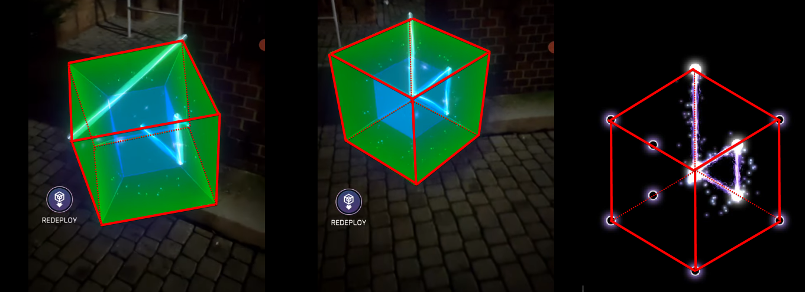
</Aside>

## 术语表

- **AR** - 增强现实
- **OC** - 超频入侵
- **激活** - 在 Wayfarer 或 Lightship 平台激活 VPS 功能
- **校准** - OC 初始化过程（成功校准将显著增加 Hack 掉落的物资）
- **输出倍数** - 影响 OC 最后输出的倍数 (掉落的物资、徽章/牌子的分数)
    <Aside>
    输出倍数依据校准结果而定 (x1-x4)。简而言之，OC 结果为：输出倍数乘以一次入侵所获得的输出。
    </Aside>
- **超立方体** - 在 OC 期间显示 Glyphs 的几何体。一个四维几何体在三维空间中的投影。（译注：读者可以参考维基百科中[四维超立方](https://zh.wikipedia.org/wiki/%E5%9B%9B%E7%B6%AD%E8%B6%85%E6%AD%A3%E6%96%B9%E9%AB%94)一文）

## 什么是OC？

OC是一种新的Hack方法，通过AR让 Glyphs在空间中呈现。其关键优势在于跟快速的从从Portal中获取物资和过热。这个新的方式只适用于已激活的Portal并在Ingress地图上有菱形标志。

通过以下方式进行OC：

<Steps>
1. 找到一个已经激活超频的Portal（可以看见有菱形形状的模型在Portal上）
2. 距离Portal 20 米内，按超频<Badge text="Overclock" variant="tip" />按钮
3. 将摄像头指向Portal的实物
4. 认出Glyphs并输入
5. 享受并重复这个过程
</Steps>

## OC如此复杂，为什么我们需要它？

尽管它增加了复杂性，但是当熟练掌握OC技巧时，它将提供大量的游戏优势。

它最大的亮点便是：一次校准的OC相当于同时进行 4 次Glyph入侵。与常规入侵手段相比它能更快速的获取物资或取得徽章/牌子点数。如一个 4 个<IWLevel l={8}/> Portal（VRMH,VRMH,VRHS）的Portal场你只需要进行 24 次OC便可以在 10 分钟之内使能量塔过热（通常能在一个薯条/能量塔压榨器时间内完成）而不是常规的 30 分钟。
但在上面这个事例中最大的问题便是，在高等级的OC入侵中很难快速熟练的解读Glyphs并在降低输出物资的同时增长你的挫败感。

## 如何激活一个Portal（使其可以进行OC）？

<Steps>
1. 使用任何一个的App（如Ingress、Pokemon GO或Wayfarer应用程序）扫描10个或更多高质量的扫描。在第一次和最后一次扫描之间至少间隔5个小时。（在5个小时内进行少于10次扫描是不足以激活的）
2. 访问网址https://lightship.dev/accoun/geospatial-browser/，或在Wayfarer应用程序中找到待激活的Po。
3. 确保扫描已上传（这可能需要几天时间，但通常会在几个小时甚至几分钟内完成）。
4. 点击 <Badge text="Activate" variant="tip" />（或<Badge text="Reactivate" variant="tip" />）按钮。
5. 如果使用Wayfarer应用程序进行激活，请等待一封确认成功激活的电子邮件。
6. 如果Po获得VPS: 激活实验性或"Fair"的状态，请进行5次或更多额外的扫描，并继续执行第4步。
7. 如果Po获得VPS: 不带实验标签或现实质量良好，请等待几天，让激活的Po在Lightship和Ingress数据库之间同步。
</Steps>

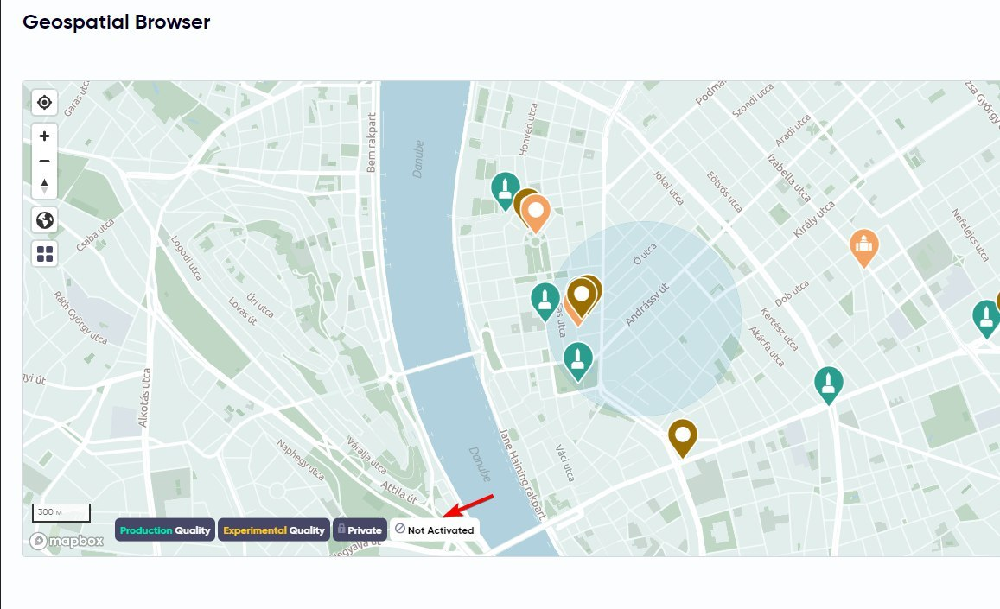

*已激活的Portal的地图.注意左下角标签过滤*

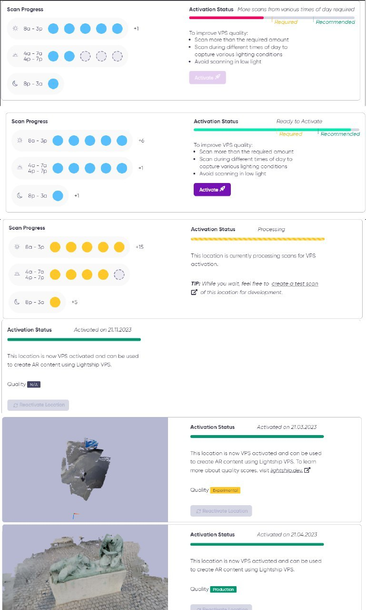
*不同的激活阶段*

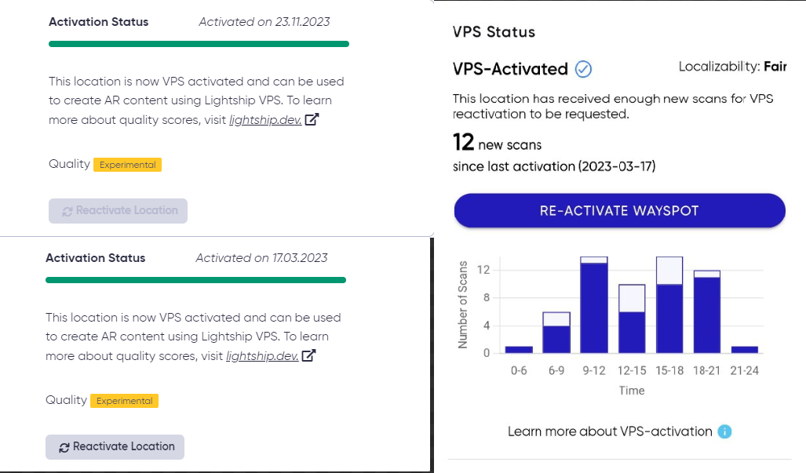

*在Lightship重新激活(左上图没有，下图有)，在Wayfarer应用程序(右图)。请注意，新的扫描只显示在Wayfarer应用程序中*

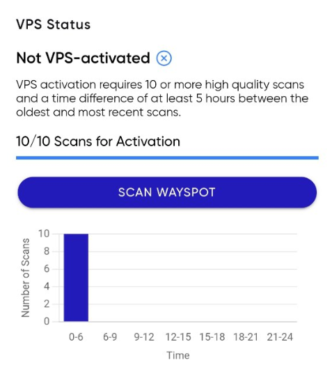

*10 个扫描至少间隔 5 个小时*

## 常见问题

**Q：有没有关于如何进行最佳扫描以成功激活的建议？**

- 在进行扫描之前清洁手机镜头。
- 在光线充足的情况下进行扫描，避免在黄昏和夜晚进行扫描。
- 当被扫描的对象没有动态阴影时进行扫描（例如，树叶下面）。
- 如果扫描一个大物体，尽量扫描相同的区域或者确保扫描之间有较大的重叠部分。
- 在我的实践中，扫描时间并不会显著影响质量，所以时间上的限制很少。
- 在以后超频时，请将扫描的地点与您计划停留的地方保持一致。
- 避免改变手机旋转和使用不寻常的角度进行扫描。
- 距离 3-6 米处进行扫描。
- 每次扫描至少要有 100 帧。如果你在 20 秒内只有约 50 帧，即使预扫描被标记为良好，这次扫描也很可能得不到得分。重新启动应用程序可能会提高帧速率。
- 如果您的帧看起来模糊，请减慢手机的移动速度。

**Q：如果无法激活Portal怎么办？**

尝试增加扫描次数，这是目前唯一的选择。

**Q：一个Portal是否可能随着时间的推移改变其激活质量，丧失自身的超频能力？**

是的，一些Portal的制作质量会随着时间的推移下降，导致超频能力丧失，直到重新激活为止。

**Q：激活需要多长时间？**

激活通常需要几个小时。

**Q：在激活后等待超频能力出现需要多长时间？**

这个时间可能从几个小时到一周不等。同步速度尚不清楚。

**Q：激活后，Portal在 Lightship的地图上消失了！发生了什么？该怎么办？会在Ingress中消失吗？**

有时，激活后，Portal会被标记为“质量不适用”。在这种情况下，它们将无法在地图的过滤器下显示出来，从而使其直接显示变得困难。您可以通过将任何其他Portal的 GUID替换到丢失Portal的链接中来访问它们。虽然它不会在Ingress中消失，但超频功能将不可用。请耐心等待，Portal应该在地图上重新出现（作者曾等待超过一周来查询一些Portal）。

**Q：Wayfarer应用程序只要求进行 5 次扫描，为什么我需要进行 10 次？**

目前，尽管应用程序只要求进行 5 次扫描，但您需要进行 10 次扫描才能激活Portal。这个差异可能是一个错误。

**Q：是否有要求我必须在一天的不同时间进行扫描才能激活？**

目前，激活过程只需要 10 次或多次高质量扫描，没有其他要求。从理论上讲，在一天的不同时间进行扫描可能会提高校准质量。

**Q：我可以激活的Portal的数量有限制吗？**

似乎在lightship.dev上，每天大约只能激活 10 个Portal，至少对一些玩家来说是如此。达到这个限制后，您可能会遇到各种错误，比如 “Unable to request VPS Activation” 和 “Rate limit exceeded”。在Wayfarer应用程序中也有限制，但以一种隐藏的方式存在：您可能按下激活按钮，但在重新启动应用程序后，状态仍未激活。

**Q：Portal是否能被自行激活？**

是的，一些Portal最初是由Niantic激活的，他们有可能在没有特工请求的情况下手动激活某些Portal。

**Q：在Portal初始激活后，是否有可能检查扫描统计信息？在Lightship中看不到任何内容，只有状态。**

您可以随时在Wayfarer应用程序中查看扫描信息。请随时使用它来跟踪初始激活后上传的扫描。

## 拓展延伸

<Aside type="danger" title="重要提示">
在非旅游地点附近进行拍摄时，务必要非常小心和耐心。即使无意中拍摄到附近的人，他们可能会感到不舒服。在公园OC过程中可能会遭到愤怒家长的纠缠，这种风险是得不偿失的。
</Aside>

### 如何通过地图找到可超频的Portal？

#### Lightship

目前，无法通过Ingress Intel查看已激活的传送门。然而，您可以使用Lightship网站的Geospatial Browser来搜索已激活的路径点。打开lightship.dev并进入地理空间浏览器，取消 “Experimental Quality” 图层的激活，因为这些Portal未能成功激活。点击图中显示的标记将显示标记的详细信息，以及扫描创建的坐标和 3D网格。如果这些标记也是Ingress中的Portal它们应该可以激活过载。

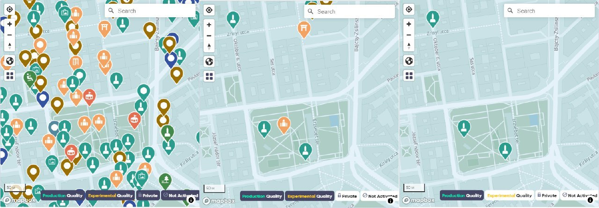

上面三张图分别为 所有 *wayspots*，激活的Portal，production quality的 Portal。注意图片底部的过滤选项。

#### OC map

<Aside type="caution">
由于Niantic关闭了全量OC数据公开，此项目已停止维护。
</Aside>

由玩家 @Chestnut_LUO在 Lightship的数据上二次开发，过滤出所有production quality的 wayspots（可OC的 Portal），每 2 小时与Lightship数据库同步

地图地址：https://oc-map.ingress.wiki/

开源仓库：https://github.com/Ingress-wiki/OverClocking-Map

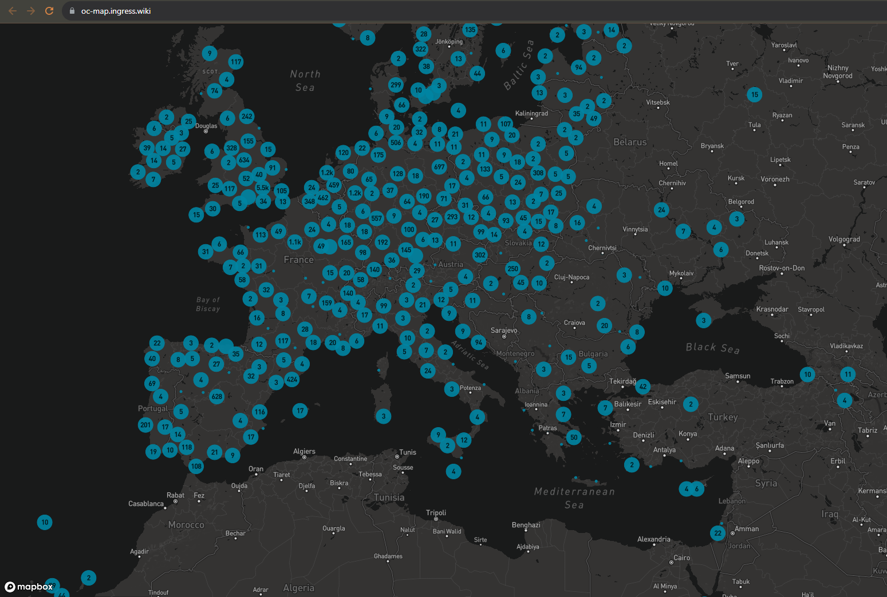

#### Wayfarer app

你也可以通过Wayfarer app去寻找已激活的Portal，但是在Wayfarer app中没有production quality过滤器

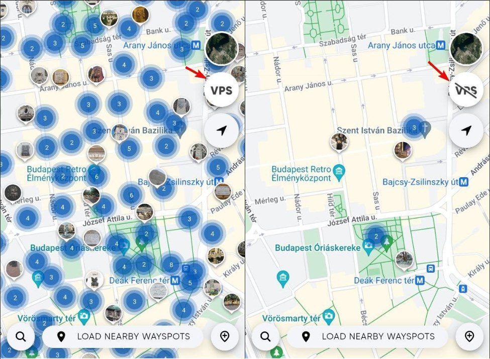

使用Wayfarer app的地图，显示所有的wayspots已激活的wayspots。

**Q：我提交的Wayspot被分类为 "**Good/Production**"，但在Ingress中无法超频。出了什么问题？**

如果一个Wayspot刚刚被激活并分类为 "**Good/Production**"，相应的Portal可能还没有激活超频功能。需要等待Ingress数据库同步，包括超频状态，因此你可能需要等待几天，才能对该Portal进行超频操作。

### 如何开始OC？

首先，请确Ingress上是否可用超频（OC）功能。您可以通过Portal的外观来判断：符合超频条件的Portal会在中央展示一个明亮的菱形图标，并且在菜单中超频按钮不会被划掉。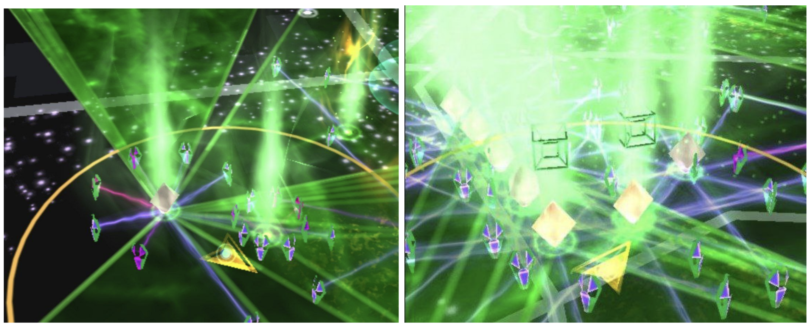

图 1:左边的Portal可超频，右侧未激活超频
图 2:如果距离Portal 20 米之内将显示菱形和超立方体

接下来，靠近Portal中心将距离保持在 20 米或更近的范围内，并在Portal菜单中按下超频按钮（如果操作正确，其背景将变成黄色）。

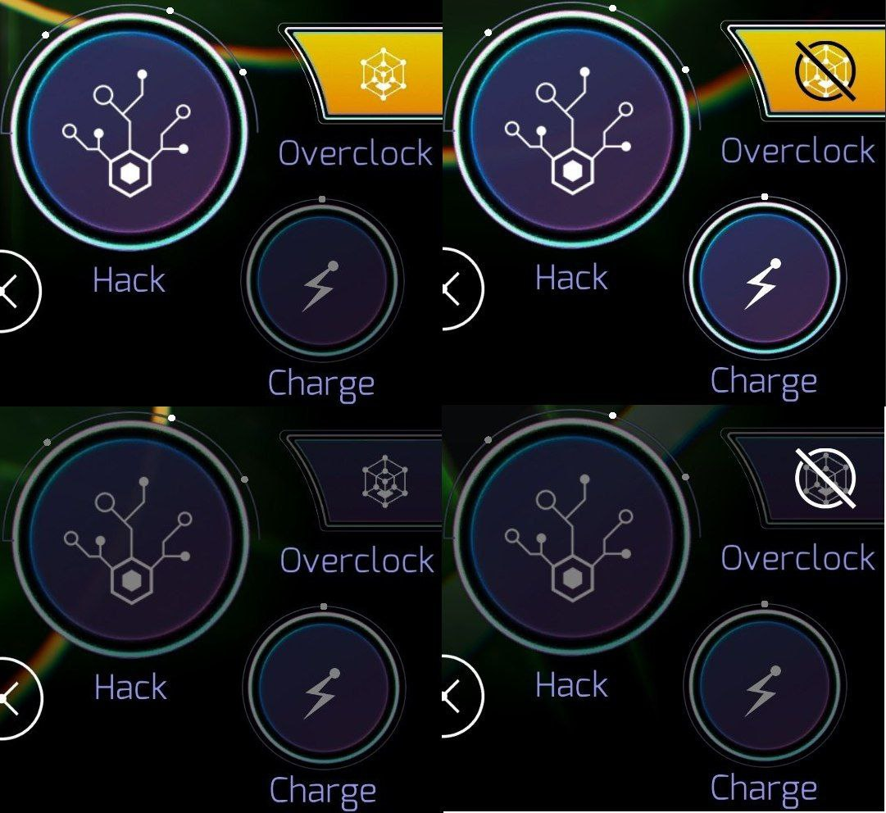

四种不同的超频按钮：左上↖️：已激活超频，在 20 米范围内  右上↗️：未激活超频，不在 20 米范围内 左下↙️：未激活超频，在 20 米范围内 右下↘️：未激活超频，不在 20 米范围内

随后，将出现一个与常规Glyphs入侵相同的命令界面。目前，只有两个选项可用：“More” 以获取Key和 “Less” 以避免获得Key。

<Aside type="note" title='如果输入了其他的命令？（如 "complex"、"simple"）'>
将显示"未知命令"，其余 Glyphs 未作测试。
</Aside>

### 校准

在输入完命令后将启动校准程序。手机摄像头将被激活并拍摄，拍摄到的视频将会被传输到游戏服务器。

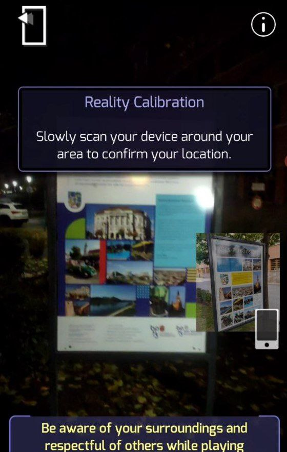

校准程序如图所示。
游戏会提示将手机来回移动，但在阴暗条件下，尽量减少移动，以拍摄更清晰的画面。

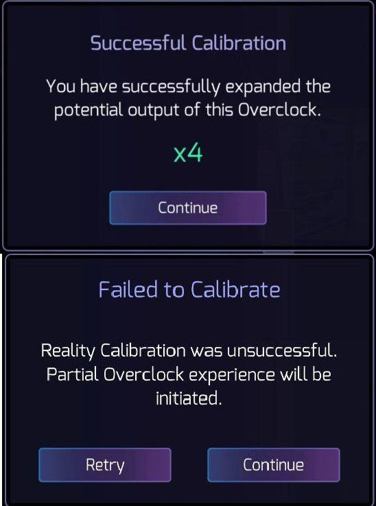

成功校准和校准失败的示意图
成功校准后将显示输出倍数，点击<Badge text="Continue" variant="tip" />将启动OC窗口。如果校准失败，您可以选择重新尝试校准<Badge text="Retry" variant="tip" />或启动未校准OC<Badge text="Continue" variant="tip" />。此外，在OC完成后，您将被提示扫描传送门以提高质量。要了解在特定Portal上需要扫描哪个精确区域进行校准，请参考该Portal在 Lightship中建立的三维模型。

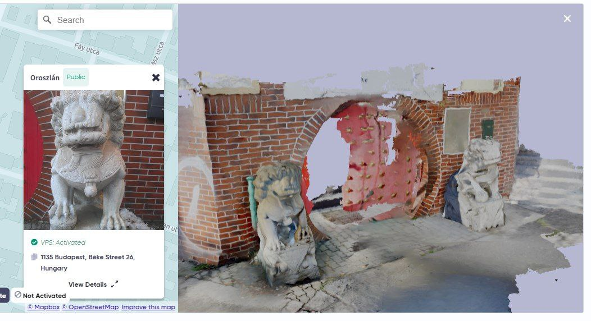

**Q：校准需要多长时间？传输多少数据？**

校准通常需要 10 秒，如果扫描良好（包括建立的模型质量和OC时质量）可以缩短到 1-2 秒。在整个校准过程中，视频以 500-700KB/s速度上传

**Q：在校准中主动退出会发生什么？**

当校准中你主动按下退出按钮会以常规Hack结算

**Q：输出倍数将如何计算？**

当校准失败输出倍数固定为x1；如果成功输出倍数最高可达到x4，具体取决于Portal在过热（大CD）前剩余的Hack次数。例如，在没有Mod的 Portal上进行一次常规Hack/Glyph入侵后使用OC入侵，如果校准成功将会获得x3 的输出倍数。在具有 2 个VRMH的 Portal上最高可以获得 5 次x4 倍数和一次x2 倍数的OC入侵。

当然，如果你想训练OC入侵可以故意校准失败。在带有一个VRMH的 Portal可以进行 16 次未校准的OC入侵，而成功校准只能进行 4 次OC。（如果想故意失败，只需对着天空或你的手进行扫描）

### 放置超立方

在放置界面中，一个预览的超立方体将出现。你需要按下<Badge text="Deploy" variant="tip" />选择一个合适的位置放置超立方。

同时你可以在屏幕上方看见你的输出倍数和校准结果，校准成功将会显示绿色，否则显示紫色。

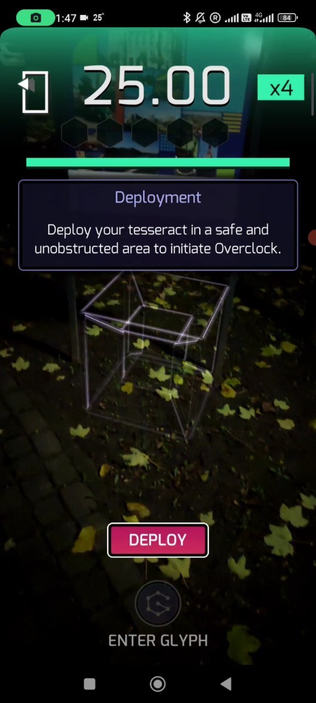

放置超立方界面。绿色背景表示校准成功。若校准不成功，则背景颜色将变为紫色。

**Q：在超立方旋转时，有没有最佳的放置超立方体的时机？**

没有，超立方无论何时都会被设定在一个特定的状态。唯一需要考虑的是在完成扫描之后大幅度运动使超粒方丢失。在放置超立方体之前转动超过 90 度可能会导致镜像符号的显示(就像从超立方体的后面看过去一样)。

**Q：有没有数据发送到Niantic服务器？有数据使用吗？**

没有，数据只在校准过程中传输；所有其他操作都在设备上执行。

### OC过程

所有Glyph都将显示在超立方内。在熟悉OC时，你可能会遇到"嗯，这是什么？"的瞬间。你要么猜一下，要么在超立方体放置的位置周围走动，将线条的排列与字形对齐。

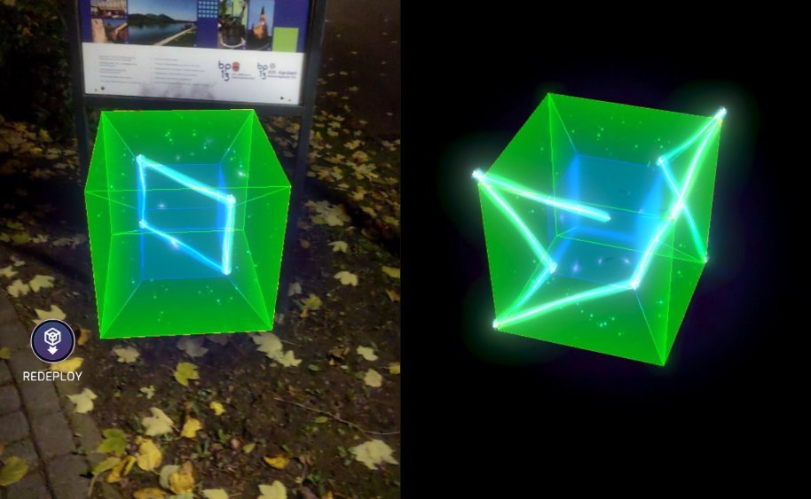

*Glyph and…glyph?*

和普通Glyph入侵一样，出现的图形数量和Portal的等级挂钩。同时也有<Badge text="Redo" variant="tip" />让您重画Glyph。

**Q：OC的 Hack的时间限制是多少？**

时间依据等级而定：

- <IWLevel l={1}/>: 48 秒
- <IWLevel l={2}/>: 36 秒
- <IWLevel l={3}/>-<IWLevel l={5}/>: 30 秒
- <IWLevel l={6}/>-<IWLevel l={7}/>: 27 秒
- <IWLevel l={8}/>: 25 秒

*嫌太少了？在更新之前<IWLevel l={8}/> 的入侵时间只有 17 秒* 🌚

**Q：经过练习最快能用多少秒完成<IWLevel l={8}/> 的OC？**

如果你幸运的找到了正确的组合（第一个Glyph显而易见且背了 5 图模板）可以在 7-8 秒内完成，否则可能需要 12-13 秒。这取决于你的练习程度。

**Q: 我需要等多久才能看到glyph的显示？超立方变换都需要很久！**

第一个符号出现前超立方会显示变换的动画。每个后续的glyph在按下上一个glyph提交按钮后的一秒钟内出现。

**Q: 我能取消之前输入的glyph吗？**

不，不可能取消前一个glyph的输入，只能取消当前glyph的输入。

**Q: 我在第一个glyph之后就理解了整个组合！我需要等待它们被绘制吗？（背图）**

如果你理解了组合，就不需要等待后续的glyph；你可以立即输入它，这完全取决于你手指的灵活性。

**Q: 顶部的条形和高亮表示什么？它是如何工作的？**

顶部条形是一个计时器，指示剩余时间，在OC期间逐渐减少。如果剩余时间超过一半，它会变为绿色；如果是 25%-50%，它会变为黄色；如果少于 25%，则会变为红色。

**Q: 如果我在OC过程中按下退出按钮会发生什么？**

在OC期间按退出按钮<Badge text="Exit" variant="tip" />结算将按照已经输入的进行结算。

**Q：如果在OC期间退出游戏会发生什么？**

和普通glyph入侵一样，你可以重新开始OC。

### 如何理解这些让人烦恼的线条？

你只需要意识到常规的glyph是将超立方体投影到二维表面上。要获取glyph，你应该围绕超立方体行走，并将其中一个角指向你。如果你选择正确，你将可以获取到glyph。

### OC结算

在输入完所有glyph后将出现一个熟悉的画面，与常规glyph入侵不同它增加了输出倍数的显示。

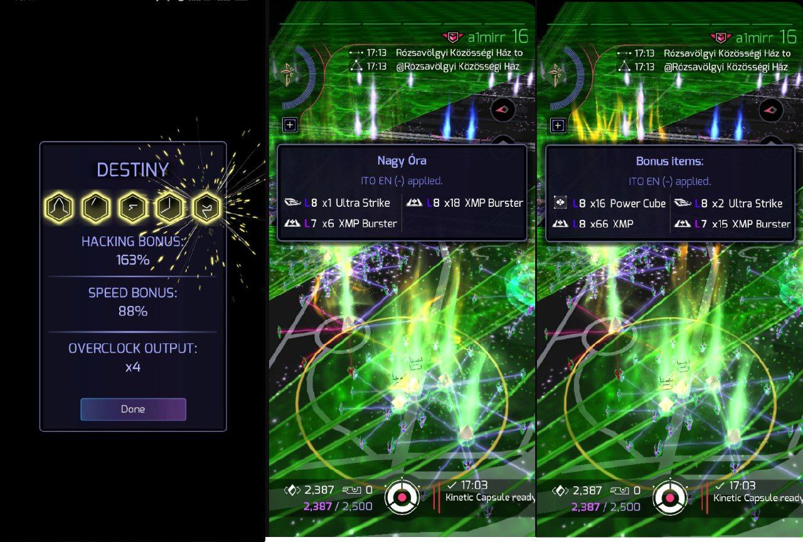

*Ingress的 11 周年纪念日上的OC结算画面*

假设你对一个<IWLevel l={8}/>Portal进行了OC输出倍数为x4，且glyph完全正确，以下为结算内容：

- 将执行四次Glyph hack，其速度奖励与OC的速度奖励相等。
- 获得四倍于Glyph hack的 AP奖励。
- Hack徽章/牌子将获得 4 个点数。
- Translator徽章/牌子将获得 15 * 4 = 60 个点数。
- Overclocker数据将获得 15 + 5 = 20 个点数。
- 将显示掉落物的总量（有时相当惊人！）。
- Portal的 Hack计数将减少 4 个。
- 冷却时间与常规Hack与 Glyph hack相当

**Q：OC会消耗多少XM？**

XM消耗将相当于进行 1 次Hack所消耗的量（在<IWLevel l={8}/> 传送门的情况下，为 400 XM）。

**Q：如果XM不足，可以进行OC吗？**

是的，可以进行OC，不进行结算且显示最终屏幕后将显示一个错误，并且您将需要重新进行Hack。但是您没有剩余XM将无法进行OC。省流：XM非空可进行OC，但如果XM小于 入侵所消耗的XM不进行结算。

**Q：fracker（能量塔压榨器）是否对OC生效？**

fracker（能量塔压榨器）适用于所有Hack。

**Q：Epoch（每日连签）增倍奖励会影响OC吗？**

如果OC是当天第一次Hack，Epoch会影响OC四次（假设为x4 输出倍率）中的其中一次，而不是全部。

**Q：如果未输入控制Glyph，将会掉落多少个Key？**

如果未输入“more”或“less”Glyph，并且库存中没有Key，则会掉落 0-1 个Key。如果Key已经在库存中，则不会掉落任何Key。

**Q：如何了解OC获得了多少Glyph点数？**

常规Glyph Hack的 Glyph点数点数乘以输出倍数。例如，对于<IWLevel l={6}/>（4 个Glyph点数）Hack，所有Glyph点数输入正确且有x3 奖励，将给出 8 * 3 = 24 个点数。

**Q：如何计算超频点数**

最近，Niantic更改了点数计算机制，现在计算如下：

未校准OC：Glyph点数 * 0.25，四舍五入

已校准OC：Glyph点数 + 5

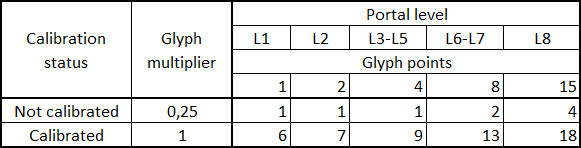

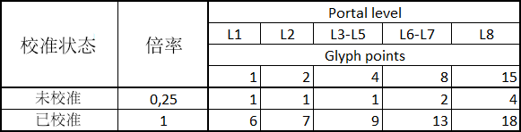
OC中 Glyph全对输出的超频点数表

校准成功额外获得 5 点

**Q：AP如何计算？**

与Glyph Hack规则一致并乘以输出倍数，无论Portal所在阵营。

### 一些有趣的事实

超立方在我们的空间中的投影由两个立方体组成：一个嵌套在另一个之内。外侧的立方体颜色依据被Hack的 Portal所在阵营而定。

在线查看超立方变换动画：https://sherif.github.io/esserac-explorer 打开轴旋转动画，并想象在四维空间中阅读旋转的超立方上的glyphs将会带来多么疯狂的体验 :)

### 已知问题

- 在某些手机上，glyph的线条几乎看不见。
- 有时（非常罕见）应用在OC过程中崩溃。
- 如果应用在第一次部署 超立方 时出现滞后，那么超立方可能会变得非常奇怪，从而更加困难地解读glyph。在这种情况下，重新部署<Badge text="Redeploy" variant="tip" />不会有帮助。
- 有时超立方可能会开始“离开”，为此niantic提供了重新部署按钮。

### OC对设备的要求

<Aside title="我们需要你的帮助！">
如了解相关情况请在 TG 上联系原作者 @a1mirr 或译者 @Chestnu_LUO，以协助更新文章。
</Aside>

有一种方法可以检查您的设备是否支持OC：打开任何启用OC的Portal，例如NL-1331门户，并尝试按下超频按钮<Badge text="Overclock" variant="tip" />。你会看到“设备不支持超频”或“无法远程超频”。

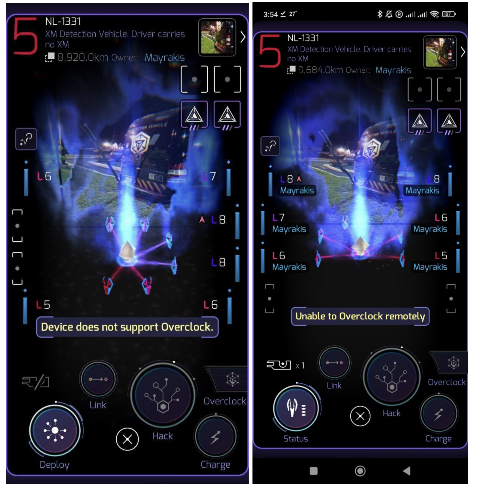

如果您的设备不支持超频，则在任何距离上按下超频按钮后会看到这一信息，“无法远程超频”。

### 已知的Glyphs序列

<Aside>
<u>**加粗且下划线**</u>的Glyph为需要注意会产生歧义的地方。当两个已知的Glyphs序列具有相同的开头在产生不同的Glyph会用<u>**加粗且下划线**</u>标注。
你可以在这个频道找到所有OC Glyphs序列的结算画面截图。[链接](https://t.me/OverclockSequences)
</Aside>

import Conditional from '@/components/Conditional.astro';

<Conditional cond={false}>
#### L8 五图 (23)
</Conditional>

<h4 id="l8-五图-23"><IWLevel l={8}/> 五图 (23)</h4>

- Avoid Chaos Avoid Shapers Lie
- Create Pure Future Human Civilization
- Destroy Lie Inside Gain Soul
- Help Human Civilization Pursue Destiny
- Human Shapers Together Create Destiny
- Inside Mind Inside Soul Harmony
- Mind <u>**Body**</u> Soul Pure Human
- Mind <u>**Technology**</u> Capture Human Soul
- Portal Potential Help Human Future
- Present Chaos Create Future Civilization
- Protec <u>**Destiny**</u> Protect Human Civilization
- Protec <u>**Human**</u> Civilization **<u>Shapers</u>** **<u>Portal</u>**
- Protect **<u>Human</u>** Civilization **<u>Shapers</u>** **<u>Lie</u>**
- Protect **<u>Human</u>** Civilization **<u>XM</u>** Message
- See Truth See Future Begin
- Shapers **<u>Portal</u>** Message Destroy Civilization
- Shapers **<u>See</u>** Complex Path Destiny
- Simple Truth Shapers Destroy Civilization
- Strong Together War Together **<u>Chaos</u>**
- Strong Together War Together **<u>Destiny</u>**
- Weak Human Destiny Destroy Civilization
- XM **<u>Create</u>** Complex Human Destiny
- XM **<u>Path</u>** Future Destiny Harmony

<Conditional cond={false}>
#### L6-L7 四图 (19)
</Conditional>

<h4 id="l6-l7-四图-19"><IWLevel l={6}/>-<IWLevel l={7}/> 四图 (19)</h4>

- All Chaos Inside Body
- Avoid XM Message Lie
- Change Future Capture Destiny
- Complex Shapers Civilization Strong
- Destroy **<u>Complex</u>** Shapers Lie
- Destroy **<u>Destiny</u>** Human Lie
- End Journey Discover Destiny
- Help Shapers Create Future
- Human Soul Strong Pure
- Portal **<u>Change</u>** Civilization End
- Portal **<u>Potential</u>** Change Future
- See Truth See Future
- Shapers Message End Civilization
- Simple Message Complex Idea
- Strong **<u>Idea</u>** Pursue Truth
- Strong **<u>Portal</u>** Strong Field
- Strong **<u>Together</u>** Avoid War
- Truth Idea Discover XM
- Weak Portal Weak Field

<Conditional cond={false}>
#### L3-L5 三图 (16)
</Conditional>

<h4 id="l3-l5-三图-16"><IWLevel l={3}/>-<IWLevel l={5}/> 三图 (目前统计到 16 种)</h4>

- All Civilization Chaos
- Avoid Destiny Lie
- Avoid Pure Chaos
- Avoid War Chaos
- Capture XM Portal
- Capture Shapers Portal
- Civilization War Chaos
- Defend Human Lie
- Discover Pure Truth
- Discover Shapers Lie
- Help Us All
- Inside XM Truth
- Potential XM War
- Pursue Complex Truth
- Pursue Pure Body
- Together Pure Journey

## 联系作者

可以在 TG 上联系原作者 @a1mirr 或译者 @Chestnu_LUO。

## 致谢

@EchoZer0, @quirischa为原版校对和建议

@InvestigateXM, @sp4cecourgette, @Shooters42 提供额外的信息

@Stems117 提供关于Glyph识别的建议

@Chestnu_LUO提供OC map

@M1chaeI提供关于POI激活限制的信息
